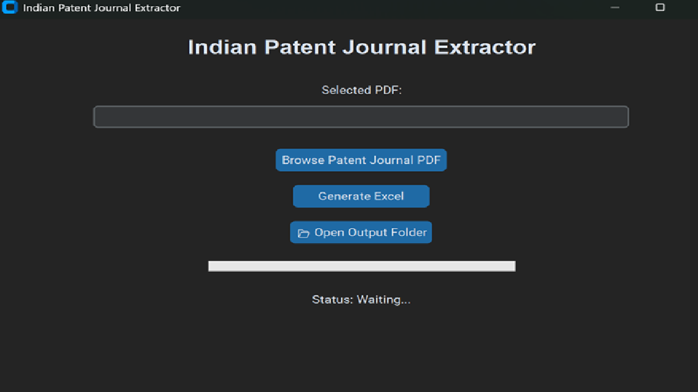
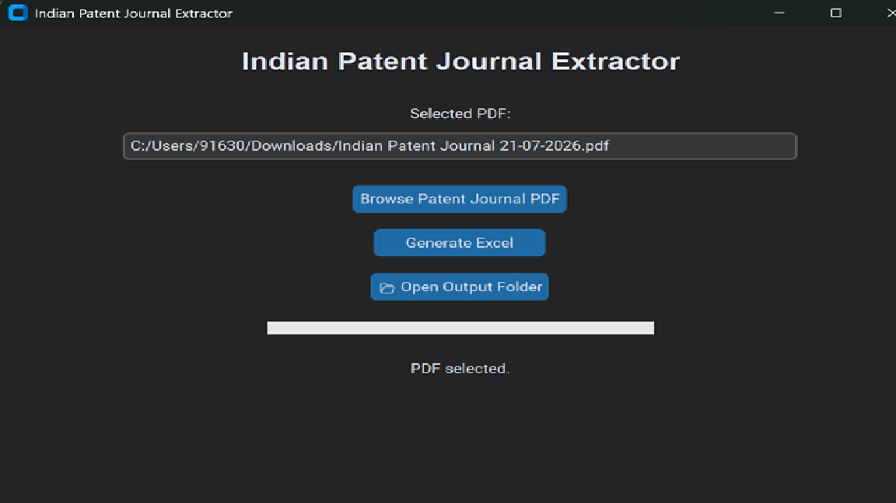
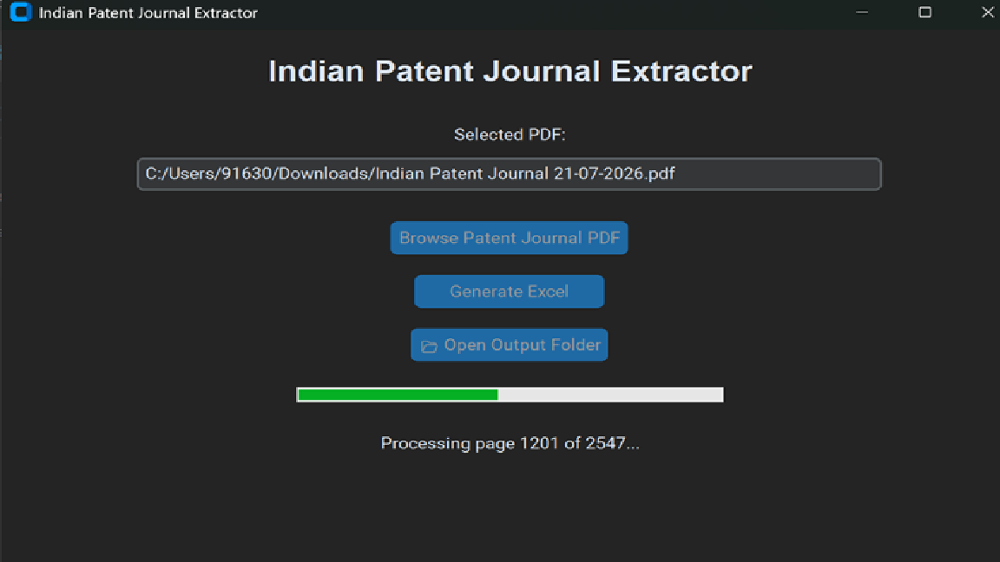
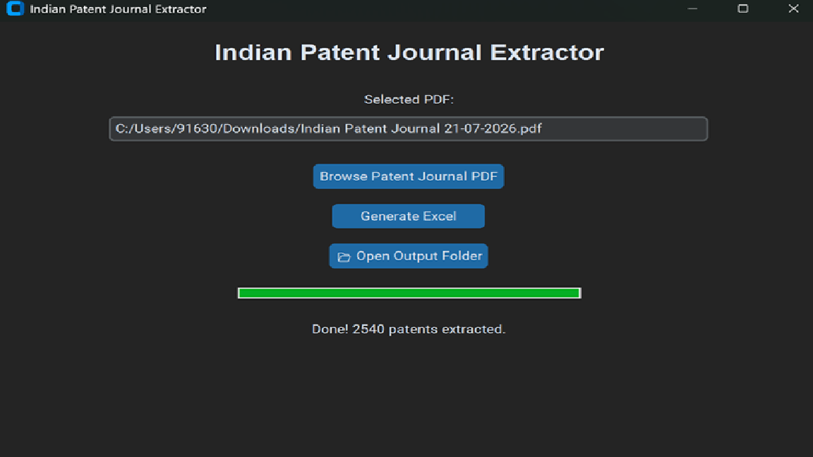
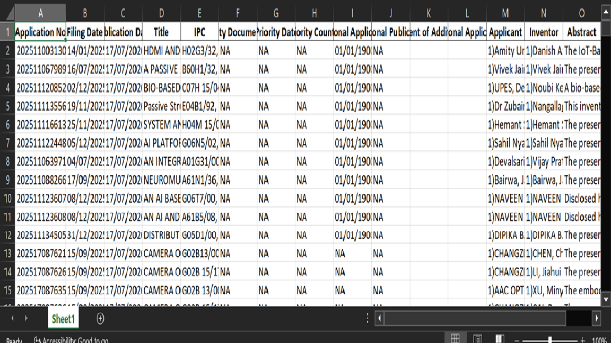

# 📄 Indian Patent Journal Extractor

<div align="center">

**Indian Patent Journal Extractor** is a modern Windows desktop application that automatically extracts structured patent information from Indian Patent Office Journal PDFs and exports it to Microsoft Excel.


</div>

---

## 📸 Application Preview



---

## 🔄 Workflow

```text
Patent Journal PDF
        │
        ▼
Extract Patent Data
        │
        ▼
Clean & Structure Data
        │
        ▼
Export to Excel (.xlsx)
```

---

## 🎯 Who is this for?

This application is designed for:

- Patent professionals
- Intellectual Property (IP) firms
- Researchers
- Innovators
- Students working with Indian Patent Office Journals

---

## ✨ Features

- 📄 Extract structured patent data from Indian Patent Office Journal PDFs
- 📊 Export extracted data to Microsoft Excel (.xlsx)
- ⚡ Fast PDF processing
- 📈 Live progress bar with page counter
- 📂 One-click Output Folder access
- 🖥️ Modern desktop interface built with CustomTkinter
- 🎨 Custom application icon
- 💻 Standalone Windows executable

---

## 🖼️ Screenshots

### 🏠 Home Screen


---

### 📂 PDF Selected



---

### ⏳ Extraction in Progress



---

### ✅ Extraction Completed



---

### 📊 Excel Output



---

## 🛠️ Technologies Used

- Python 3.9
- CustomTkinter
- PyMuPDF (fitz)
- OpenPyXL
- Regular Expressions (Regex)
- PyInstaller

---

## 📂 Project Structure

```text
Indian-Patent-Journal-Extractor/
│
├── screenshots/
│   ├── home.png
│   ├── pdf_selected.png
│   ├── progress.png
│   ├── completed.png
│   └── output_excel.png
│
├── cleaner.py
├── excel_writer.py
├── gui.py
├── patent_extractor.py
├── patterns.py
├── icon.ico
├── requirements.txt
├── README.md
└── .gitignore
```

---

## 🚀 Running from Source

```bash
git clone https://github.com/vamshipalsani7/Indian-Patent-Journal-Extractor.git

cd Indian-Patent-Journal-Extractor

pip install -r requirements.txt

python gui.py
```

---

## 📦 Windows Executable

The standalone Windows executable can be downloaded from the **Releases** section of this repository

---

## 📦 Current Release (v3.0.0)

Download the latest executable from the **Releases** section.

### ✅ Included Features

- Patent Journal PDF extraction
- Excel export
- Progress tracking
- Page processing counter
- Output folder shortcut
- Modern desktop interface
- Standalone Windows executable
- Custom application icon

---

## 🚀 Roadmap

- [x] Patent Journal Extraction
- [x] Excel Export
- [x] Desktop GUI
- [x] Progress Tracking
- [ ] Batch PDF Processing
- [ ] Applicant Search
- [ ] Inventor Search
- [ ] IPC Search
- [ ] CSV Export
- [ ] JSON Export
- [ ] Patent Analytics Dashboard
- [ ] AI-assisted Patent Analysis
- [ ] Web-based Patent Intelligence Platform

---

## 🤝 Contributing

Contributions, bug reports, and feature suggestions are welcome.

If you discover an issue, feel free to open an Issue or submit a Pull Request.

---
## 📄 Disclaimer

This project is an independent software tool developed to simplify the extraction of publicly available information from Indian Patent Office Journal PDFs. It is not affiliated with or endorsed by the Indian Patent Office.

---

## 👨‍💻 Developer

**Vamshi Palsani**

Cyber Security Graduate, Edge Hill University, United Kingdom.

GitHub: [@vamshipalsani7](https://github.com/vamshipalsani7)

---

## ⭐ Support

If you found this project useful, consider giving it a **Star ⭐** on GitHub.

It helps others discover the project and motivates future development.